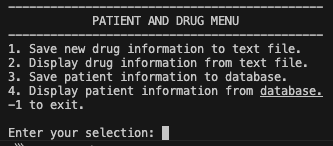
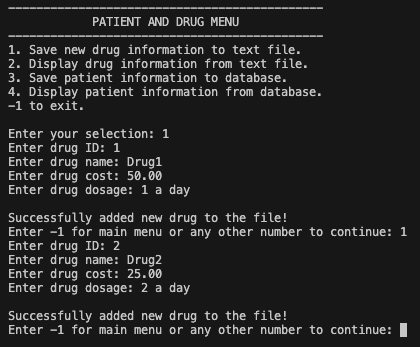
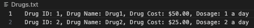
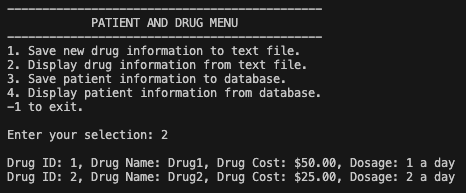
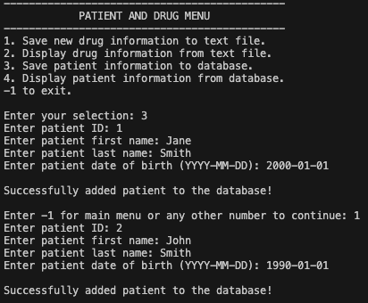
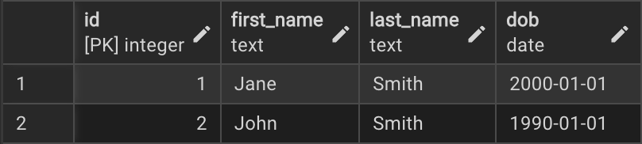
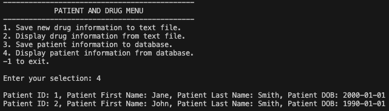

# QAP 4 – Data Persistence with PostgreSQL and Text Files

## Project Description

This project is a Java console application that demonstrates data persistence using both text files and a PostgreSQL database. Users can save and display drug information using a text file and save and display patient information using a PostgreSQL database through a menu-driven interface.

## Project Summary

This project was initially challenging because it required combining several concepts we had learned, including file handling, PostgreSQL, JDBC, and object-oriented programming. The most challenging aspect for me was deciding how to organize the application and where user input should be handled. Once I settled on the overall structure, the rest of the project fell into place. After finishing this assignment, I feel much more confident working with Java, particularly with database connections and data persistence.

## Screenshots

### Main Menu

### Saving Drug Information

### Drug Text File

### Displaying Drug Information

### Saving Patient Information

### Patients Database

### Displaying Patient Information

